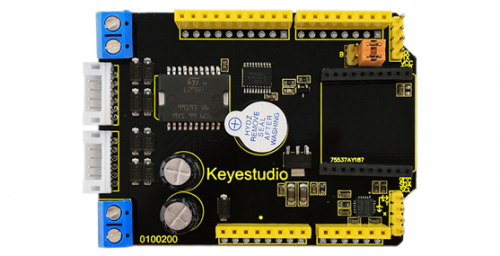
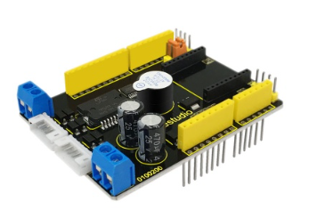
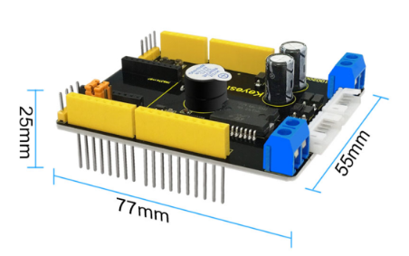
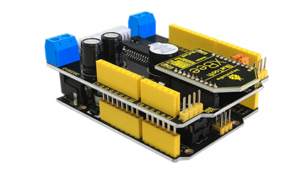

# KS0202 keyestudio Balance Car Shield



## 1. Introduction

This keyestudio shield is particularly developed for balance car based on Arduino development board. It mainly use the driver chip L298P produced by LGS Electronics, which is specially applied to large power motors. So the shield can drive two DC motors, and the driven current is up to 2A.

It adopts the MPU6050 chip, and uses the built-in data management platform DMP to output the processing data through IIC interface.



## 2. Parameters

- 1. Working Voltage: DC 12V
- 2. Working Current in driver: ≤ 2 A
- 3. Working Temperature: 0℃ to 80℃
- 4. Coming with xbee/Bluetooth Bee wireless interface
- 5. On-board buzzer(D6) used as alarming
- 6. D11 as PWM pin 1 of motor 1, D9 as PWM pin 2 of motor 2, D 10 and D12 as output pin of motor 1, D8 and D7 as output pin of motor 2
- 7. With two PH2.0-6P motor interfaces

## 3. Technical Details

- Dimensions: 77mmx 55mmx 25mm
- Weight: 31g



## 4. Connection Diagram

Simply stack it onto the UNO board



## 5. Sample Code

**Library files and code download：**[Resources](./Resources.7z)

```c
/*
    MPU6050 Triple Axis Gyroscope & Accelerometer. Free fall detection.
    Read more: http://www.jarzebski.pl/arduino/czujniki-i-sensory/3-osiowy-zyroskop-i-akcelerometr-mpu6050.html
    GIT: https://github.com/jarzebski/Arduino-MPU6050
    Web: http://www.jarzebski.pl
    (c) 2014 by Korneliusz Jarzebski
*/

#include <Wire.h>
#include <MPU6050.h>

MPU6050 mpu;

boolean ledState = false;
boolean freefallDetected = false;
int freefallBlinkCount = 0;

void setup() 
{
  Serial.begin(115200);

  Serial.println("Initialize MPU6050");

  while(!mpu.begin(MPU6050_SCALE_2000DPS, MPU6050_RANGE_16G))
  {
    Serial.println("Could not find a valid MPU6050 sensor, check wiring!");
    delay(500);
  }

  mpu.setAccelPowerOnDelay(MPU6050_DELAY_3MS);
  
  mpu.setIntFreeFallEnabled(true);
  mpu.setIntZeroMotionEnabled(false);
  mpu.setIntMotionEnabled(false);
  
  mpu.setDHPFMode(MPU6050_DHPF_5HZ);

  mpu.setFreeFallDetectionThreshold(17);
  mpu.setFreeFallDetectionDuration(2);	
  
  checkSettings();

  pinMode(4, OUTPUT);
  digitalWrite(4, LOW);
  
  attachInterrupt(0, doInt, RISING);
}

void doInt()
{
  freefallBlinkCount = 0;
  freefallDetected = true;  
}

void checkSettings()
{
  Serial.println();
  
  Serial.print(" * Sleep Mode:                ");
  Serial.println(mpu.getSleepEnabled() ? "Enabled" : "Disabled");

  Serial.print(" * Motion Interrupt:     ");
  Serial.println(mpu.getIntMotionEnabled() ? "Enabled" : "Disabled");

  Serial.print(" * Zero Motion Interrupt:     ");
  Serial.println(mpu.getIntZeroMotionEnabled() ? "Enabled" : "Disabled");

  Serial.print(" * Free Fall Interrupt:       ");
  Serial.println(mpu.getIntFreeFallEnabled() ? "Enabled" : "Disabled");

  Serial.print(" * Free Fal Threshold:          ");
  Serial.println(mpu.getFreeFallDetectionThreshold());

  Serial.print(" * Free FallDuration:           ");
  Serial.println(mpu.getFreeFallDetectionDuration());
  
  Serial.print(" * Clock Source:              ");
  switch(mpu.getClockSource())
  {
    case MPU6050_CLOCK_KEEP_RESET:     Serial.println("Stops the clock and keeps the timing generator in reset"); break;
    case MPU6050_CLOCK_EXTERNAL_19MHZ: Serial.println("PLL with external 19.2MHz reference"); break;
    case MPU6050_CLOCK_EXTERNAL_32KHZ: Serial.println("PLL with external 32.768kHz reference"); break;
    case MPU6050_CLOCK_PLL_ZGYRO:      Serial.println("PLL with Z axis gyroscope reference"); break;
    case MPU6050_CLOCK_PLL_YGYRO:      Serial.println("PLL with Y axis gyroscope reference"); break;
    case MPU6050_CLOCK_PLL_XGYRO:      Serial.println("PLL with X axis gyroscope reference"); break;
    case MPU6050_CLOCK_INTERNAL_8MHZ:  Serial.println("Internal 8MHz oscillator"); break;
  }
  
  Serial.print(" * Accelerometer:             ");
  switch(mpu.getRange())
  {
    case MPU6050_RANGE_16G:            Serial.println("+/- 16 g"); break;
    case MPU6050_RANGE_8G:             Serial.println("+/- 8 g"); break;
    case MPU6050_RANGE_4G:             Serial.println("+/- 4 g"); break;
    case MPU6050_RANGE_2G:             Serial.println("+/- 2 g"); break;
  }  

  Serial.print(" * Accelerometer offsets:     ");
  Serial.print(mpu.getAccelOffsetX());
  Serial.print(" / ");
  Serial.print(mpu.getAccelOffsetY());
  Serial.print(" / ");
  Serial.println(mpu.getAccelOffsetZ());

  Serial.print(" * Accelerometer power delay: ");
  switch(mpu.getAccelPowerOnDelay())
  {
    case MPU6050_DELAY_3MS:            Serial.println("3ms"); break;
    case MPU6050_DELAY_2MS:            Serial.println("2ms"); break;
    case MPU6050_DELAY_1MS:            Serial.println("1ms"); break;
    case MPU6050_NO_DELAY:             Serial.println("0ms"); break;
  }  
  
  Serial.println();
}

void loop()
{
  Vector rawAccel = mpu.readRawAccel();
  Activites act = mpu.readActivites();

  Serial.print(act.isFreeFall);
  Serial.print("\n");
  
  if (freefallDetected)
  {
    ledState = !ledState;

    digitalWrite(4, ledState);

    freefallBlinkCount++;

    if (freefallBlinkCount == 20)
    {
      freefallDetected = false;
      ledState = false;
      digitalWrite(4, ledState);
    }
  } 
  delay(100);
}
```

